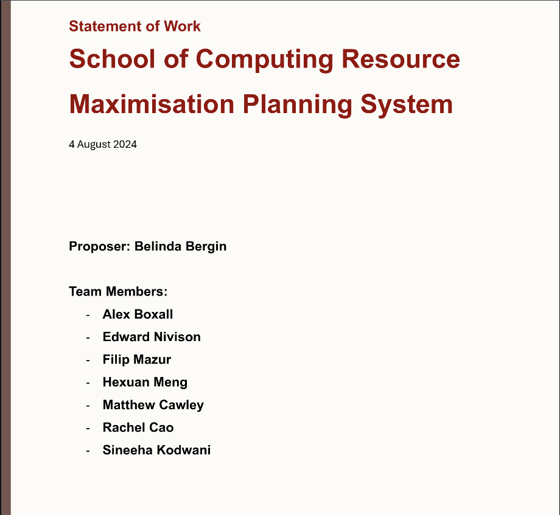
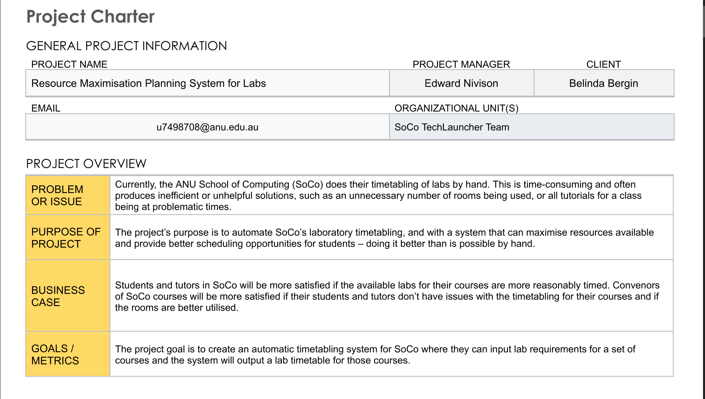

# SoCo - *Resource Maximisation Planning System for Labs*

Our aim for this project is to create a resource allocation application for SoCo computer labs. The app will make use of resources available and be adaptable to new entries to create a working timetable for the Computing courses and the limited resources (Computer Lab rooms) whilst following a strict set of pre-defined constraints and restrictions.

The end vision of the project will be to have a application that will adapt to new entries and create the best layout of courses in a given week based on the strict restrictions and constraints.

## Table of Contents

- [Team Members and Roles](#team-members-and-roles)
- [Statement of Work](#statement-of-work)
- [Team Charter](#team-charter)
- [Project Schedule](#project-schedule)
- [Project Output](#project-output)
- [User Documentation](#user-documentation)
- [Technical Constraints](#technical-constraints)
- [Project Resources](#project-resources)
- [Project NDA and IP status](#project-nda-and-ip-status)
- [Problematisation Analysis](#problematisation-analysis)
- [Client's Vision and objectives](#clients-vision-and-objectives)
- [Stakeholder Analysis](#clients-vision-and-objectives)
- [Handover Process / Development Checklist](#handover-process--development-checklist)
- [Technical Reports](#technical-reports)
- [Logs](#logs)
- [Meeting Minutes](#meeting-minutes)
- [Acknowledgements](#acknowledgements)

## Team Members and Roles

| UID | Name | Courses.Course | Role | Skills |
|--|--|--| -- | -- |
| u7498708 | Edward Nivison | COMP3500 | Project Manager | Documentation, Decisions, Reflections, User Documentation, Frontend support, Server support, User support. |
| u7468248 | Alex Boxall | COMP3500 | Backend Designer | Backend development, Fitness Function, Backend Documentation, Database, Server. |
| u7605165 | Hexuan Meng | COMP8715 | Backend and Testing | Backend development, Fitness Function. |
| u6934917 | Filip Mazur | COMP3500 | Spokesperson | Frontend Development, Database API, User support. |
| u7313113 | Matthew Cawley | COMP3500 | Developer | Backend Development, Database Development, User Documentation. |
| u7556970 | Rachel Cao | COMP3500 | Backend and Admin | Decisions, Reflections, Frontend Support. |
| u7230574 | Sineeha Kodwani | COMP3500 | Deputy Spokesperson | Frontend Development, User support. |

## Team member contribution

The best way to view the team member contribution would be to look at the Github Issues (Open and Closed) that are assigned to them. It should be noted though that a majority of the issues remained unassigned but were still actioned by the individual.

Another way would be to look at meeting attendance in our meeting minutes.

And lastly you can also view analytics for GitHub to see commit regularity, who commits, and what they have committed. It should be noted, that by default it shows the analytics for the "Main" branch, as most work has been done off main branch, in "dev" and other subsets, you will find more development in those branches as "Main" gets updated down the line.

## Statement of Work

%20TL-Lab%20Allocator%20-%20Statement%20of%20Work_Signed%20-%2019%20August%202024.pdf)

See more by clicking the link below.

[Statement of Work](docs/audit-documentation/(Current)%20TL-Lab%20Allocator%20-%20Statement%20of%20Work_Signed%20-%2019%20August%202024.pdf)

## Team Charter

See more by clicking the link below.

[Team Charter](docs/audit-documentation/project-charter.pdf)

## Project Schedule

## Project Output

You can find our project output in the link below. It details some of our major outputs for the project. However, the best place you can find what is being done is the GitHub  that are relevant.

You can look at the GitHub Projects as well (see the tab projects), you can see the Standup and the Roadmap to see what state the issue is in. There are archived completed issues as well (see the three-dots button in the top right, and view archived items).

What we have majorly done is improving the backend to fit some new criteria the client has made evident to us. The frontend has been running user testing and improving the look and feel of the program. We have also been working with the School of Computing Facility Team to get a backend server running where we have been developing an on-campus database. We have been working on transferring from the firebase to the new database, and we have been making documentation for the user and the developer.

[Project output and descriptions on what is being done.](docs/audit-documentation/output)

## User Documentation

Here you can find the Wiki that we have implemented into the actual product. It is accessible on all pages, and details what each element of the page does. This is just a clone of the wiki that we have on the GitHub Repository for Audit purposes, and if the user stumbles across it. You can find it .

## Technical constraints

### Reliability

- **Fault Tolerance**: In case of the server going down, client devices shutting down, and other cases. The program should have a save point every so often it can revert back to. This could be as simple as saving the point of time it is at somewhere and replacing it every so often.
- **Error Handing**: There should be specific case errors written when developing this application so the user/developer can understand what is being done incorrectly and doesn't leave them clueless as to why the program is not working.
- **Data Integrity**: There should not be changes to the data directly unless it is explicitly asked by the end-user (and even so with confirmation). The data should be changed via copying it, not changing it directly at the source.
- **Monitoring and Logging**: There should be a method of monitoring and logging functionalities to track system performance, identify issues proactively and faciliatate troubleshooting.

### Security

- **Access Control**: There should be a hierarchy of who can access certain parts of the program, and this should include any sensitive data and functionalities within the application.
- **Data Encryption**: Utilize encryption techniques to protect sensitive data from un-authorized tampering.
- **Authentication and Authorization**: Implement secure authentication mechanisms to verify the identities of users and grant appropriate permissions based on their roles.
- **Secure Communication**: Ensure that data exchanged between the application and external systems is transmitted securely over encrypted channels, such as HTTPS or other secure formats.

### Safety

- **Code Review and Testing**: Conduct thorough code reviews and testing to identify and address security vulnerabilities, bugs, and logic errors that could potentially compromise the safety and reliability of the application. This may involve manual code reviews, automated static code analysis, and dynamic application security testing (DAST).
- **Data Privacy and Protection**: Implement measures to safeguard sensitive data collected and processed during the development process, such as personally identifiable information (PII) and confidential project docuemtns. This may include data anonymization, encryption, and access controls to protect against data breaches and un-authorized access.
- **Version Control and Change Management**: Utilize versioning control and change management, for example using pull requests when changes are made with a code review in place to ensure whatever the new addition is, is not going to compromise safety.
- **Dependency Management**: Regularly review and update dependencies (e.g., libraries, frameworks, third-party components) used in the application to address security vulnerabilies and ensure compatibility with security patches and updates released by vendors.
- **Documentation and Training**: Provide comprehensive documentation and training materials to developers and other stakeholders on secure development practices, security guidelines, and incident response procedures to promote awareness and adherence to safety and security best practices throughout the development lifecycle.

### Other

- **Computiational Complexity**: Scheduling and timetabling is a computationally complex problem - as the number of classes and constraints increases, it takes exponentially more time to find an optimal solution. For the number of classes the system is required to schedule, it is infeasible to test all combinations of schedules. The system will need to use a more efficient approach to find a solution that is as close to optimal as possible in a reasonable time. 

## Project Resources

### Risk Management

Risk management involves identifying potential risks that could threaten the success of a project, assessing their likelihood and potential impact, and planning strategies to mitigate or avoid them. For the "School of Computing (SoCo) Resource Maximisation Planning System for Labs" project at the Australian National University (ANU), a structured approach to risk management is essential given the project's complexity and the diverse needs of its stakeholders. Here's a detailed risk management plan:

**Risk Identification**

- **Technical Challenges**: Development complexities related to scheduling algorithms and user interfaces.
- **Stakeholder Engagement**: Effective communication and engagement with all project stakeholders.
- **Data Accuracy and Completeness**: Dependence on precise and complete data for scheduling.
- **Integration with Existing Systems**: Seamless integration with ANU's existing IT systems.
- **User Adoption**: Ensuring user transition and acceptance of the new system.
- **Regulatory and Policy Compliance**: Compliance with ANU policies and regulatory standards.
- **Budget and Resource Constraints**: Management of budgetary limitations and resource allocation.
- **Timeline Delays**: Potential delays impacting project milestones and delivery.
- **Scalability and Performance**: System's ability to accommodate growth and maintain efficiency.

**Risk Assessment**

- **Technical Challenges**: High likelihood; High impact.
- **Stakeholder Engagement**: Medium likelihood; High impact.
- **Data Accuracy and Completeness**: High likelihood; High impact.
- **Integration with Existing Systems**: Medium likelihood; Medium impact.
- **User Adoption**: High likelihood; High impact.
- **Regulatory and Policy Compliance**: Low likelihood; High impact.
- **Budget and Resource Constraints**: Medium likelihood; Medium impact.
- **Timeline Delays**: High likelihood; High impact.
- **Scalability and Performance**: Medium likelihood; High impact.

**Risk Mitigation Strategies**

- **Technical Challenges**: Engage expert developers, conduct extensive testing, and implement phased rollouts.
- **Stakeholder Engagement**: Maintain regular updates, establish clear communication channels, and involve stakeholders in key decisions.
- **Data Accuracy and Completeness**: Implement stringent data validation protocols, regular data audits, and a system for reporting data discrepancies.
- **Integration with Existing Systems**: Collaborate with IT departments early on to ensure compatibility and smooth integration.
- **User Adoption**: Offer comprehensive training, ongoing support, and detailed documentation.
- **Regulatory and Policy Compliance**: Conduct regular reviews of ANU policies, ensure development compliance, and integrate legal consultations.
- **Budget and Resource Constraints**: Allocate a contingency budget, regularly review financial and resource allocations.
- **Timeline Delays**: Adopt an Agile methodology to enhance adaptability and manage delays effectively.
- **Scalability and Performance**: Design with scalability in mind, conduct performance stress tests.

**Monitoring and Review**

A structured schedule will be implemented for ongoing risk monitoring, assessment of emerging risks, and evaluation of mitigation strategies. This will involve regular check-ins with the project team and stakeholders to ensure active and effective risk management throughout the project's lifecycle.

### Risk Register

We have identified any potential risks from our reflections and have actioned on them as they are needed to be done. This is inclusive to things that have been asked of us, such as implementing LDAP authentication and ensuring that data is secure on the server and that only authorised personnel can have access to it. This is just one of the many items that we have identified and actioned on.

### Project costs

The only expected costs for the project would be for the hardware for the server (i.e. a computer). During development/prototyping a student’s computer could be used, and the final system is expected to run on computers provided by the School of Computing / university at no cost. There should be no need for domain name registration as the system is expected to run on the internal university network.

As we have an on-campus server up and running now, this is true. It is of no cost to us since our client is the School of Computing, we have access to a virtual machine server that is being hosted and maintained by the School of Computing Facility Team.

The other resources required is data about labs, rooms and enrollments, which have been provided by the client.

## Project NDA and IP status

The IP of the solution will remain the property of the students in the group, so long as the School of Computing is able to continue to use and modify the software freely.

## Problematisation Analysis

[Problematisation Analysis](docs/audit-documentation/problematisation-analysis.md)

## Client's Vision and objectives

- **Efficiency**: To develop a system capable of creating the most efficient lab schedules, maximising the use of available resources.
- **Flexibility**: To accommodate a wide range of constraints and course requirements, ensuring the system's applicability across various teaching periods and evolving academic needs.
- **Usability**: To provide a user-friendly interface that allows staff to input constraints, view schedules, and make adjustments as needed.
- **Scalability**: To ensure the system can handle an increasing number of courses, labs, and constraints without a decrease in performance.

## Stakeholder Analysis

| Stakeholder | Reason | 
|--|--|
| Client | They are commissioning the system so that it can serve their needs in allocating labs to classes. | 
| School of Computing administrative staff | They may be using the system after it is complete to enter data about course enrolments, lab sizes, etc. |
| Courses.Course convenors | Need to provide information to the system/School about tutor numbers, and may also have other requirements that affect scheduling | 
| Students | Effective scheduling of classes has a number of benefits to students: Leads to fewer clashes, meaning students can attend more classes ; Ensures the tutor to student ratio is maintained, so students get enough support during classes. |
| Tutors | Effective scheduling of classes ensures that tutor to student ratios are not exceeded, making it easier for tutors to teach. |
| Other users of the buildings in scope | Effective scheduling means less room times are taken up by labs, allowing others to use the rooms for other purposes. |
|-|-|
|Techlauncher Tutors| The tutors from Techlauncher have stakes in our project, for marking purposes, they also have the potential to provide feedback on development practices, and project output. |
|Shadow Team| The shadow has stakes in the project for audits, from providing feedback to also being a potential user to test and receive feedback from. |

## Handover process / Development Checklist

As a starting project in Semester 1, 2024 we do not have an existing codebase or project to work from. So to allow the next generation of developers for this project, we will have a detailed explanation of the project, the backend, the frontend,
and how the logic and algorithm provides the solution to the problem that our client at the School of Computing wants solved.

As a project, we are coding using Java for the backend, Springboot to talk to the server, Firebase as our "current" file server (we are looking into more long term plans with a physical server on-campus), and React as our coding language for the frontend.
We plan to integrate all the above using an api to interface with the backend and to run the backend and server on the same device in the long run.

As for developing, you can find the relevant setup process in the docs/technical-reports folder on how to setup your IDE/environment in the way that our development team has done so.

There will be sufficient communication during a handover process between the prior team and the upcoming members to make sure that they understand and can reach out if there are any misunderstandings with the project.

However we plan to minimise as much confusion as possible with relevant comments in the code, documentation on the github repository, and FAQs if we get a sufficient amount of common mistakes that take place.

We have created a development checklist for how to manage GitHub issues, the github projects page, how to document decisions and reflections that are being made.

[Development Checklist](docs/development-documentation/development-checklist.md)

## Technical Reports

[Technical Reports](docs/audit-documentation/technical-reports)

## Logs

We have been keeping a majority of our decisions in the decisions logs but also inside of each meeting.
Reflections are kept in their relevant logs.
Communication with the client is consistent (when the client is available) with regular meetings and communication through email and team messages.

**IMPORTANT NOTICE**
Over the course of the semester, we have reflected on how we process and deliver our decisions and reflections.
We have opted to keep the same structure from the previous semester, with the additions of a few new rules
and implementations. This includes:

- A new method of reporting any **decisions** through a GitHub Issue. You can reference this issue through commits, comments, pull requests, etc. This is so we can make the process of decision making easier and more appealing to do. We still will import all the decisions formally through to the decision log, but think of this as an intermediary stage of the decision making process. See issue [#93](https://github.com/mazfil/lab-allocator/issues/93)
- A new method of reporting any **reflections** and actions in regards to the reflections through a GitHub Issue. This is so you can reference the issue in any commits, comments, pull requests, etc. This is so we can make the process of reflections easier and more convenient for our project members to complete. Think of this as an intermediary stage of the reflection process. We make sure that we reflection and create new issues in regards to any feedback and comments we receive from fellow project members, client, stakeholders, shadow team, and tutors. See issue [#92](https://github.com/mazfil/lab-allocator/issues/92)

[Decision Logs](docs/audit-documentation/logs/Decision-Log.md)

[Audit Reflection Log](docs/audit-documentation/audit-reflection.md)

[Reflection Log](docs/audit-documentation/logs/reflection-log.md)

[Client Communication Log](docs/audit-documentation/logs/client-communication-log.md)

## Meeting Minutes

- [Client Meetings](docs/audit-documentation/meetings/client-meetings)
- [Team Meetings](docs/audit-documentation/meetings/team-meetings)
- [Tutorial Meetings](docs/audit-documentation/meetings/tutorial-meetings)

## Acknowledgements

Appreciation for the Lecturers, Convenors, Examiners, Tutors, and Speakers for the Australian National University course COMP3500 - Software Engineering Project, and its respective parallel courses being run. Thanks for everything you are doing to help us through our journey in Computer Science.

We are also especially thankful to the School of Computing Facility team for setting up and hosting our project on-campus with one of their server solutions. For their assistance and patience we are eternally grateful for.
