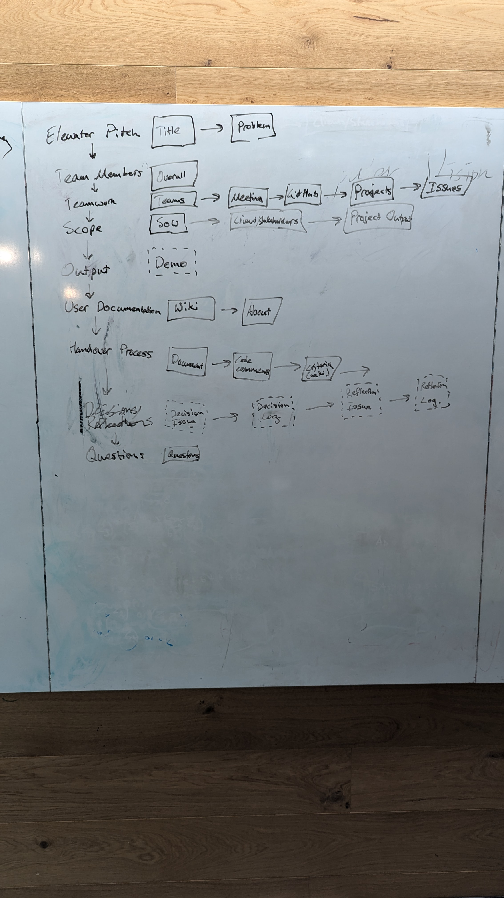
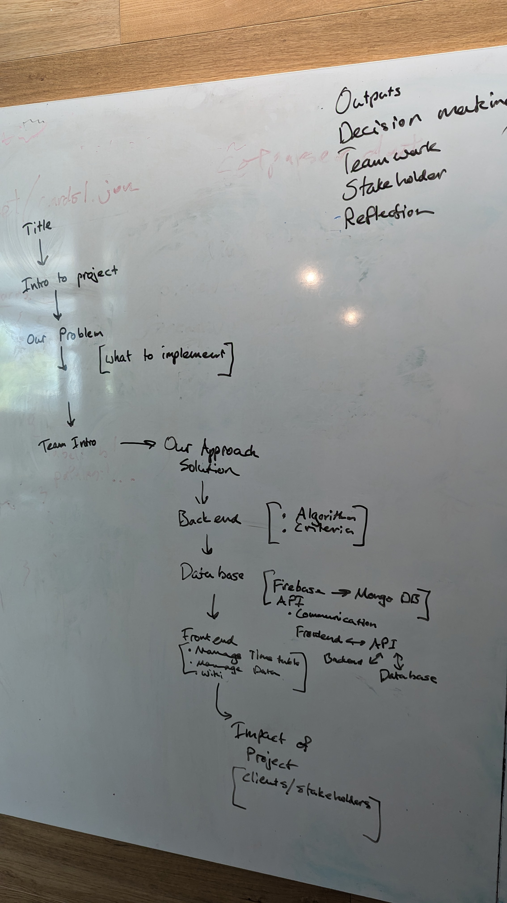

## 30-09-24 Update on progress.

We have been working on a user testable version of the project. This includes multiple changes to the database API that we have made from scratch. Working on the on-campus server to get things running consistently.

We are working on user testing this week. One of them is today with a Stakeholder in the School of Computing Staff team. They are meeting with us today 30-09-24 14:00-15-00.

The second meeting for user testing is with the client in the School of Computing Staff team. They are meeting with us 02-10-24 09:00-10:00.

We are also doing storyboarding for the project video and the audit presentation.

**Audit Presentation Structure**

**Project Video Structure**

We also conducted a survey with project team members, client and stakeholders about the colour preferences for the UI when viewing the timetable.

There are probably more that I can't think of right now, but view all the Github Issues and GitHub Projects to see more! Especially closed ones.
