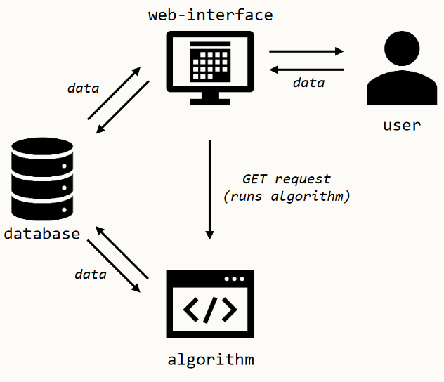

## Brief Overview of Project for Developers

The lab allocator project consists of three parts: a web interface, a backend algorithm, and a database. All three are hosted by one server physically at ANU and are accessible through HTTP.
Their interaction is described in this image:

The web interface uses React and is how the user accesses the allocator.
The backend is programmed in Java and its purpose is to be inputted course information, and output a generated timetable.
The database stores two sets of data: course data, which stores information about each course such as the code and the number of students etc.; and a timetable if one has been made.

Outline of generic use of the application: 
1. The user accesses the web interface, which downloads course data and the timetable (if they exist) from the database to show to the user.
2. The user can add/edit course data, which the frontend will send to the database for storage.
3. If the user then wants to generate a new timetable, they can click a generate button, which sends a GET request to the backend.
4. Upon receiving this request, the backend retrieves course information from the database and generates a timetable. It then stores this timetable in the database.
5. The frontend retrieves the generated timetable from the database to show to the user, who can edit it if they want.

For more detailed information on each part, see the respective folders.
