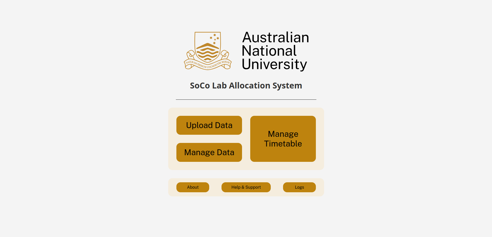
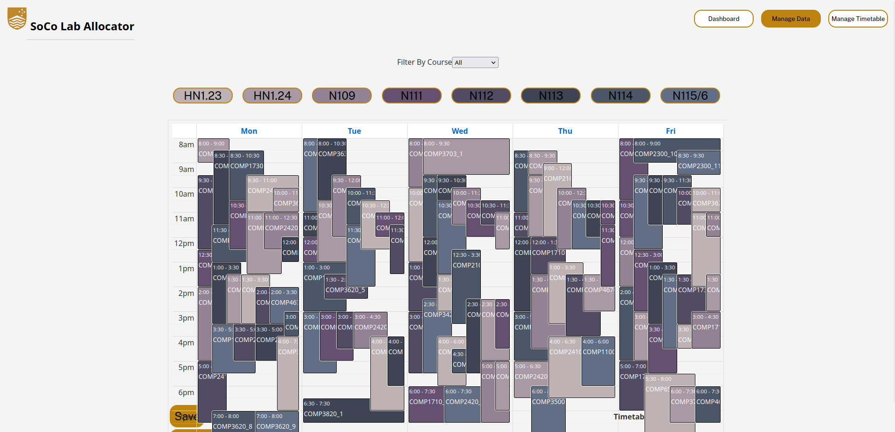
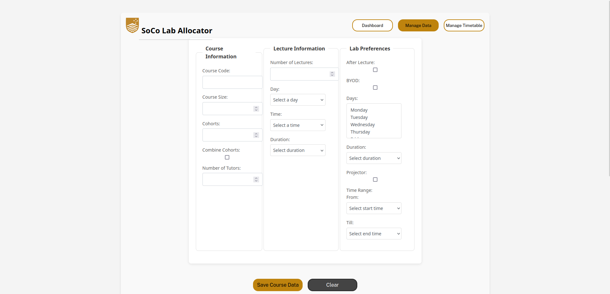
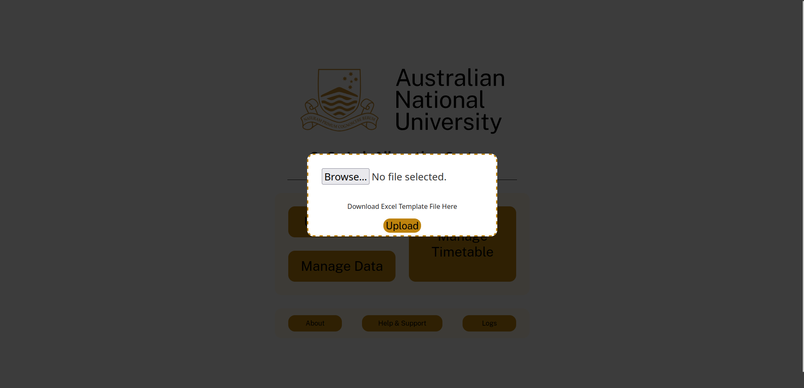
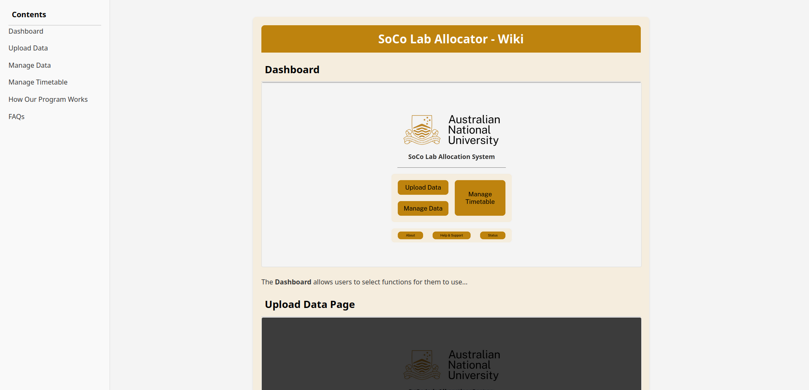
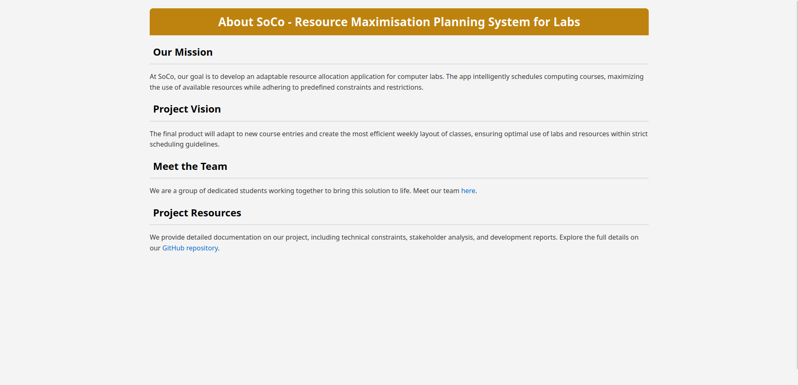

# Project Overview

In this project, we have developed a system that includes a functional frontend, backend, server, and database setup. Below is a breakdown of the major components we worked on:

## Frontend Development

We developed several key pages for the frontend, ensuring that each provides a smooth and intuitive user experience. The frontend is designed to allow users to manage and interact with the system easily:

- **Dashboard**: The central hub where users can quickly access key statistics, upcoming events, and recent activities. It provides an overview of system performance and shortcuts to other sections of the application.
  
  

- **Manage Timetable**: A page dedicated to organizing and adjusting the system's timetable allocation. Users can add, remove, or edit entries, ensuring the schedule is always up to date and meets specific requirements.

  

- **Manage Data**: This page provides the interface for overseeing and editing datasets. Users can manipulate the data that feeds into the system’s logic, ensuring that everything is accurate and up to date.

  

- **Upload Data**: A simple, user-friendly page where users can upload new datasets or update existing ones. The process is streamlined to reduce errors and handle various file formats.

  

- **Wiki**: This page serves as an information repository, where users can access documentation and helpful articles about using the system. It is designed to be easily searchable and regularly updated.

  

- **About**: A static page that provides information about the project, its creators, and the objectives behind the system. It also includes links to contact and support channels.

  

## Backend Development

The backend plays a critical role in processing requests and managing the logic behind the frontend. Recently, we have been working on extra fitness functions at the client's request. These functions are used to apply new criteria to the allocation process, ensuring that the system adapts to evolving needs and preferences.

## Server Setup

To meet the requirement of running the system independently on campus computers, we set up a standalone server. This server ensures the system can function reliably without relying on external resources, which is crucial for on-site operations.

## Database Setup

Initially, we explored Firebase for our database solution, but it proved unsuitable for long-term needs. We transitioned to MongoDB, which offers the flexibility and scalability necessary for the system’s growth and data management needs.

## API Development

We developed an API to facilitate communication between the frontend and backend. The API handles data exchanges, ensuring that the system remains synchronized and responsive. In future updates, we plan to implement security measures to safeguard API communications and protect sensitive data.

## Summary

In summary, the project involves:
- A multi-page frontend with key functionalities
- A backend that handles extra criteria in the allocation process
- A standalone server for campus use
- A MongoDB database for long-term data management
- An API connecting the frontend and backend, with plans for future security enhancements

We are now in the phase of testing and refining each of these components to ensure the system works smoothly as a whole.
