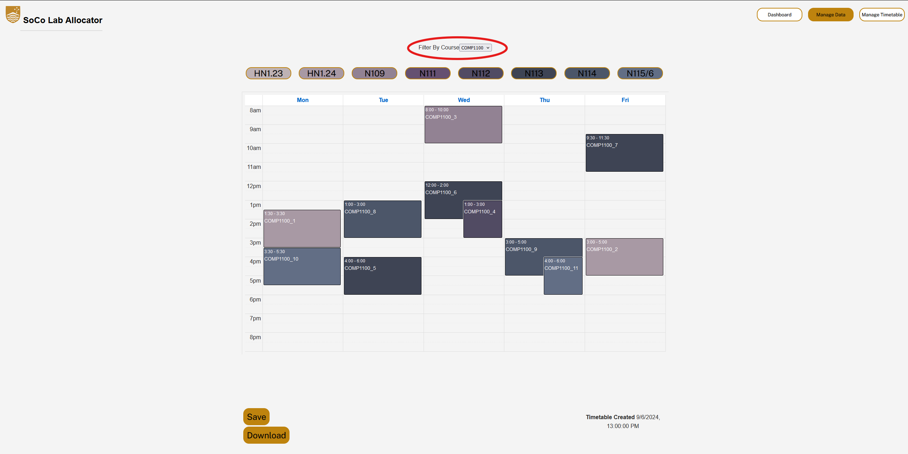

# SoCo Lab Allocator - Wiki

## Contents
- [Dashboard](#dashboard)
- [Upload Data Page](#upload-data-page)
- [Manage Data Page](#manage-data-page)
- [Manage Timetable Page](#manage-timetable-page)
- [How Our Program Works](#how-our-program-works)
- [FAQs](#faqs)

---

## Dashboard

The **Dashboard** is the first page that you see when you access SoCo Lab Allocator.

You can upload your data, manage the data that you upload, and manage the timetable that is generated.

There is also this Wiki, and About to give you some help. If you ever have any extra issues that are not conveyed by the Wiki, please feel free to leave a GitHub Issue on the Repository linked in the About Page.

---

## Upload Data Page

The **Upload Data Page** allows the user to upload data formatted in a **CSV format**.

There is an **example template** that you can download to view the preferred format for the algorithm. However, the system should work dynamically with the structures discussed during development.

When the CSV file is uploaded, the algorithm will generate a timetable according to the criteria we have laid out. You will be able to view the timetable on the **Manage Timetable Page**, and you will also have the option to **export** it from there.

---

## Manage Data Page

In the **Manage Data Page**, users can view and modify the data they previously entered via the upload data page.

### Editing the Data
**Course Information**:
- **Course Code**: Usually formatted as "COMP####" or just as "####".
- **Course Size**: The size (number) of students in the course.
- **Cohorts**: Designate how many cohorts there are for the course. For example, COMP1100 and COMP1130 are two cohorts but share labs.
- **Combine Cohorts**: Tag that indicates the course is a combined cohort.
- **Number of Tutors**: The estimated number of tutors running the course.

**Lecture Information**:
- **Number of Lectures**: Number of lectures the course might have.
- **Day**: Select the day(s) the lecture(s) are on.
- **Time**: Select the time(s) of the lecture(s).
- **Duration**: Select the duration of the lecture(s).

**Lab Preferences**:
- **After Lecture**: Schedule labs only after the selected lecture time(s). If not selected, labs can be scheduled anytime from 8 am Monday to 8 pm Friday.
- **BYOD**: Tag the course as BYOD (Bring Your Own Device), meaning it doesn't necessarily need lab computers.
- **Days**: Select which days the lab should be allocated. Only those selected days will be used.
- **Duration**: Set the duration of the labs.
- **Projector**: Tag indicating that the lab requires a room with a projector.
- **Time Range**: Set the time range (start and end) when labs can be scheduled, e.g., between 9:00 am and 5:00 pm.

You can:
- **More**: View more of the course details.
- **Edit**: Edit course details by bringing information to the top of the page.
- **Delete**: Delete the course and its entries from the database (irreversible).

---

## Manage Timetable Page

The **Manage Timetable Page** allows you to view the generated timetable and make adjustments as needed.

By default, it shows the entire generated timetable.

You can filter the timetable by clicking the **room buttons** above the timetable to disable rooms from view. This can help with readability by hiding the rooms you don't want to see.

The **colours** in the timetable correspond to the **rooms** that the courses are allocated to.

You can also filter by **course code** using the **dropdown** at the top of the page. The dropdown updates dynamically as courses are added or removed.

To make changes, **hold** the left-click button and drag the course timeslot to a new location. The system prevents **double-booking** of a room at the same time.

---

## How Our Program Works
Our algorithm contains several functions designed to generate and optimize lab allocation timetables. The core focus of these functions is to ensure that the schedule meets various constraints while aiming for efficiency and flexibility.

### Key Functions for Optimal Allocation
1. **`getFitness()`**: Calculates the fitness score of a schedule by evaluating factors such as free space, time allocation, and variance. Higher fitness indicates a better schedule.
2. **`aimForPercentWithin(int start, int end, double desiredPercent)`**: Allocates classes within a defined time window.
3. **`aimForPercentBeforeTime(double desiredPercent, int before)`**: Allocates classes before a certain time.
4. **`aimForPercentAfterTime(double desiredPercent, int after)`**: Allocates classes after a certain time.
5. **`getDateVariance()`**: Calculates how evenly classes are distributed across days of the week.
6. **`getRoomVariance()`**: Evaluates the distribution of classes across rooms.
7. **`getPercentageFree()`**: Calculates the percentage of free time across all rooms.
8. **`getPercentDupes()`**: Measures the percentage of duplicate time blocks.
9. **`alwaysRoomFree()`**: Ensures at least one room is always free.
10. **`repeatLabsSameRoom()`**: Ensures repeat labs occur in the same room.
11. **`placeLabRandomly()`** & **`placeCourseRandomly()`**: Randomly place labs and courses while respecting constraints.
12. **`mutate()`** & **`moveLabRandomly()`**: Introduce random changes to explore new schedule configurations.
13. **`crossover(Schedule a, Schedule b)`**: Combines two schedules to create a new one, simulating a genetic algorithm.

---

## Frequently Asked Questions (FAQs)

### Are changes made by dragging saved automatically?
No, if you move rooms around or change rooms, nothing is saved until you press the save button. So make sure you don't change off the page, otherwise you will lose your work.

### Can I overwrite a course assignment in the same room?
Yes, you can assign multiple labs or courses to the same room. However, you will receive a warning before proceeding to prevent unintentional conflicts.

### Can I move a course or lab to a smaller room?
Yes, you can move a course or lab to a smaller room. However, you will be given a warning if the selected room may not be able to accommodate all students effectively.

### Can I modify the algorithm, such as the fitness function?
No, you cannot directly edit the algorithm or its components through the interface. However, supporting documentation is available on GitHub ([GitHub link](https://github.com/mazfil/lab-allocator)), which allows for manual modifications. These changes should only be attempted by someone with technical knowledge of coding and programming.

---

## Footer
&copy; 2024 SoCo Lab Allocator. All rights reserved.
